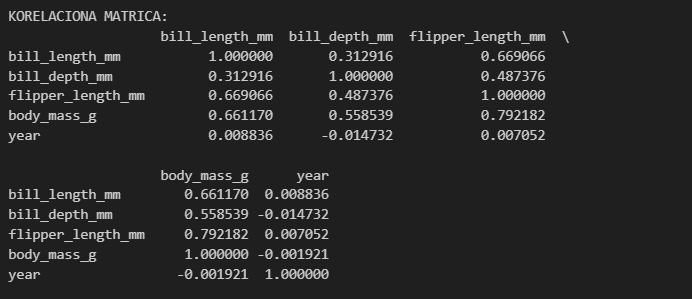
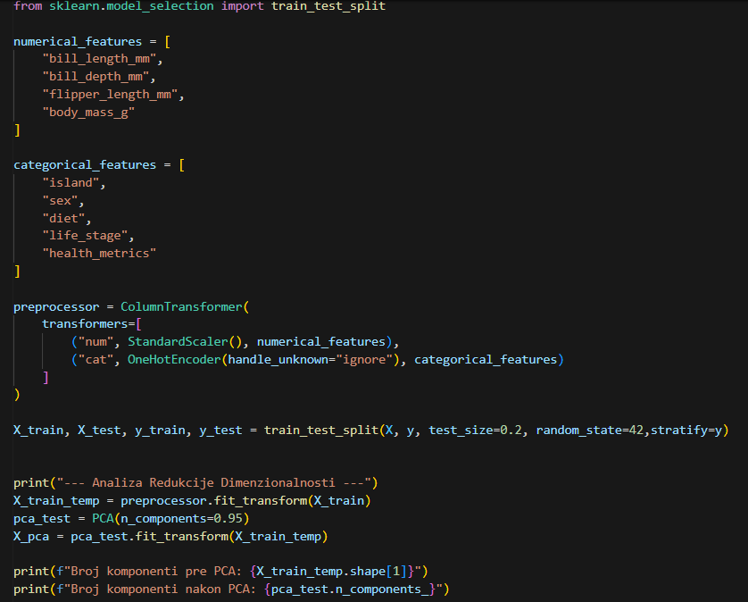
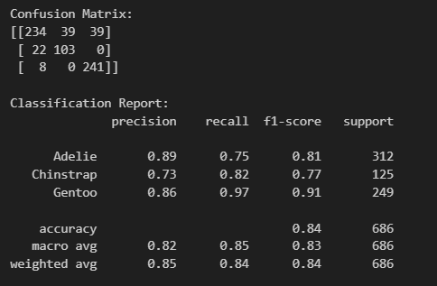
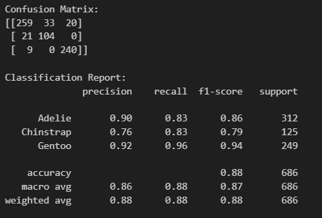

# Diskusija i interpretacija rezultata projekta – Klasifikacija vrsta pingvina (Palmer Penguins Extended)

**Napomena:**  
Detaljan kod i sirovi izlazi (npr. confusion matrix, classification report, grafovi i ispisi rezultata) nalaze se u originalnim notebook-ovima, zajedno sa diskusijom u okviru Markdown sekcija. Ovaj dokument predstavlja objedinjeni skup zaključaka preuzetih iz tih Markdown delova.  
- 01_exploration_penguins.ipynb (eksploracija i deskriptivna analiza)  
- 02_algorithms_and_interpretability.ipynb (algoritmi, optimizacija, interpretabilnost)  

Svi zaključci su bazirani na literaturama "Statistical Methods for Machine Learning" i "ML Python Cookbook".

## 1. Obrada podataka i priprema za modelovanje

U prvom koraku projekta izvršena je inicijalna analiza skupa podataka palmerpenguins_extended.csv. Dataset sadrži 3430 instanci i 11 kolona, što predstavlja dovoljno veliki uzorak za stabilno treniranje modela. Identifikovane su numeričke varijable (fizičke mere pingvina) i kategorički atributi (ostrvo, pol, ishrana, životna faza, zdravstveni status).

Analiza numeričkih atributa pokazuje da podaci nemaju nedostajuće vrednosti, ali poseduju različite raspone i varijanse, zato je bilo potrebno standardizovati te podatke pre primene određenih klasifikacionih algoritama. Deskriptivna statistika je neophodna, prema metodologiji iz knjige "Statistical Methods for Machine Learning", za otkrivanje potencijalnih ekstremnih vrednosti (outliers) i razumevanju varijabiliteta unutar uzorka.

Nakon numeričke analize, izvršena je analiza kategoričkih atributa. Utvrđeno je da ciljna varijabla species sadrži tri vrste, pri čemu je vrsta Adelie najzastupljenija (1560 instanci), dok Chinstrap čini najmanji deo uzorka. Ovo ukazuje na blagu debalansiranost klasa, što može da utiče na performanse modela.
Takođe, primećeno je da su ostali atributi, poput pola (sex), lokacije (island) i ishrane (diet), ravnomerno raspoređeni ili logički grupisani.

Na osnovu korelacione matrice primećeno je da dužina peraja (flipper_length_mm) i telesna masa (body_mass_g) imaju visoku korelaciju (0.79), što je biološki logično. Godina merenja ne utiče na fizičke karakteristike pingvina, jer pokazuje skoro nultu korelaciju sa svim ostalim faktorima.

Potom na osnovu dobijenih rezultata iz analize skupa podataka, za ciljnu varijablu (y) odabrana je kolona species, dok su za prediktore (X) zadržani svi relevantni biološki atributi. Kolona year je trajno uklonjena iz skupa podataka.

Formiran je cevovod (pipeline) koji koristi ColumnTransformer za simultanu obradu različitih tipova informacija. Numerički atributi su standardizovani pomoću StandardScaler-a, što je proces koji transformiše podatke tako da im srednja vrednost bude 0, a standardna devijacija 1. Ovo sprečava da varijable sa velikim rasponima, poput telesne mase u gramima, veštački dominiraju nad manjim merama poput dubine kljuna. Istovremeno, kategorički podaci su transformisani putem OneHotEncoder-a, koji svaku tekstualnu kategoriju pretvara u zasebnu binarnu kolonu (0 ili 1). Ovim postupkom se izbegava uvođenje lažnog matematičkog poretka među kategorijama (npr. da model ne pomisli da je jedno ostrvo "veće" od drugog).

Drugi deo procesa fokusiran je na redukciju dimenzionalnosti pomoću PCA (Analize glavnih komponenti), sa ciljem da se zadrži 95% varijanse (informacija) originalnog skupa. PCA funkcioniše tako što pronalazi nove, nekorelisane komponente koje najbolje opisuju širenje podataka, omogućavajući nam da smanjimo broj ulaznih faktora bez značajnog gubitka kvaliteta modela. Rezultat je pokazao da se broj kolona može značajno redukovati, što potvrđuje da su mnoge biološke mere pingvina međusobno povezane i nose slične informacije.

Pre samog treniranja algoritama, izvršena je podela skupa podataka na trening (80%) i test set (20%) korišćenjem funkcije train_test_split. Ovaj postupak je neophodan kako bi se evaluacija modela izvršila na podacima koje algoritam nije video tokom faze učenja, čime se simulira realna primena i proverava sposobnost generalizacije. Ovakva podela sprečava pojavu preprilagođavanja (overfitting), gde bi model postigao visoku tačnost samo memorisanjem primera iz baze. Parametar stratify osigurava da distribucija klasa (vrsta pingvina) ostane proporcionalna u oba podskupa. S obzirom na to da su određene vrste zastupljenije od drugih, stratifikacija sprečava rizik da test set dobije nesrazmerno mali broj uzoraka ređih vrsta, što bi dalo pogrešnu sliku o preciznosti modela.

## 2. Rad algoritama: Opis, optimizacija i evaluacija

### 2.1 Random Forest
Za klasifikaciju vrsta pingvina odabran je Random Forest jer se ovaj model smatra jednim od najpouzdanijih za biološke podatke. Umesto da se oslanja na jednu odluku, on koristi "glasanje" različitih stabala odlučivanja, što drastično smanjuje šansu za greškom i čini model otpornijim na postojeće specifičnosti u podacima. 

Nakon definisanja osnovne strukture, izvršena je optimizacija pomoću RandomizedSearchCV algoritma, koji je postavljen iznad prethodno kreiranog Pipeline-a. Proces učenja (Random Forest) treba da se prilagodi specifičnostima podataka koji su prošli kroz fazu pretprocesiranja. Parametri poput broja stabala (200–800) i maksimalne dubine (10–50) su definisani u širokim opsezima kako bi se izbeglo preprilagođavanje i omogućilo modelu da identifikuje kompleksne biološke obrasce.

Fabrička podešavanja retko daju optimalne rezultate na proširenim skupovima podataka. Korišćenjem F1-weighted skoringa, optimizacija se fokusirala na postizanje maksimalne preciznosti za svaku vrstu pingvina ponaosob, ćime se osigurava da model podjednako dobro prepoznaje i ređe zastupljene klase u uzorku.

Nakon optimizacije, izvršena je finalna evaluacija. Postignuta ukupna tačnost iznosi 84%, što ukazuje na visoku sposobnost modela da generalizuje naučene obrasce na nove primere. Analizom matrice zabune i klasifikacionog izveštaja, primećeno je da model najbolje identifikuje vrstu Gentoo (F1-score 0.91), zbog njihovih jedinstvenih bioloških karakteristikama koje ih jasno distanciraju od ostalih vrsta.

S druge strane, klasifikacija vrsta Adelie i Chinstrap pokazala je nešto niže vrednosti odziva (recall), zbog preklapanja njihovih fizičkih atributa. Matrica zabune otkriva da model najčešće greši u razlikovanju ove dve vrste.  Analizom dijagonalnih elemenata matrice vidi se visoka stopa tačnih predviđanja, dok vrednosti van dijagonale ukazuju na specifična preklapanja između vrsta.

### 2.2 Logistic Regression
Kao drugi model u istraživanju korišćena je Logistička regresija. Za razliku od Random Forest-a, koji je ne-linearan model, logistička regresija je linearni klasifikator. Ona pretpostavlja postojanje linearne veze između karakteristika (poput mase i dimenzija kljuna).

Ovaj model je izabran zbog svoje lake interpretacije. Logistička regresija se često koristi kao osnovni (baseline) model jer njeni koeficijenti jasno pokazuju kako i u kojoj meri svaka karakteristika utiče na odluku modela. U implementaciji je korišćen parametar max_iter = 1000 kako bi se obezbedilo da algoritam pravilno konvergira na standardizovanim podacima.

Nakon Random Forest modela, logistička regresija je trenirana i optimizovana kao jednostavnija, linearna alternativa. Cilj je bio da se proveri da li ovakav model može postići slične rezultate kao složeniji model zasnovan na stablima.

I ovde je izvršena optimizacija pomoću RandomizedSearchCV . Posebna pažnja posvećena je parametru C, pri čemu je korišćen širok opseg vrednosti kako bi se pronašao dobar balans između regularizacije i tačnosti modela. 

Nakon optimizacije hiperparametara, Logistička regresija postigla je tačnost od 88%. Detaljna analiza matrice zabune pokazuje da model poseduje dobru sposobnost identifikacije vrste Gentoo (F1-score 0.94), što ukazuje na to da su karakteristike ove vrste linearno razdvojive u odnosu na ostale.

Međutim, primećuje se određeni stepen preklapanja između vrsta Adelie i Chinstrap. Relativno niži precision za Chinstrap vrstu (0.77) pokazuje da model određene Adelie jedinke pogrešno klasifikuje zbog sličnosti u njihovim biometrijskim parametrima. Ovi rezultati služe kao dokaz da, iako je linearni model veoma efikasan, određeni biološki obrasci zahtevaju nelinearne modele (poput Random Forest-a) za još preciznije razgraničenje. Ipak, za potrebe interpretacije i razumevanja uticaja pojedinačnih faktora, postignuti rezultati Logističke regresije su veoma dobri.

U linearnim modelima poput Logističke regresije, značaj karakteristika se interpretira kroz vrednosti naučenih koeficijenata. Veća apsolutna vrednost koeficijenta ukazuje na snažniji uticaj te varijable na šanse logaritma da jedinka pripada određenoj klasi.

Za potrebe ovog rada, izračunat je prosek apsolutnih vrednosti koeficijenata kroz sve tri klase (Adelie, Chinstrap, Gentoo), čime je dobijena globalna rang lista važnosti atributa. Ovakav pristup omogućava direktno poređenje sa Random Forest modelom. Rezultati pokazuju da model dodeljuje najveće težine morfološkim parametrima koji imaju jasnu linearnu separabilnost.

Radi objektivnije procene performansi modela Logističke regresije, sprovedena je unakrsna validacija sa 5 podskupova (5-fold cross-validation). Umesto oslanjanja na samo jednu podelu podataka, ovaj metod omogućava proveru stabilnosti modela kroz različite iteracije obuke i testiranja.

Postignut je prosečan F1-score od 87%, sa niskom varijancom između pojedinačnih krugova validacije (raspon od 0.83 do 0.90). Ovakva konzistentnost rezultata, ukazuje na visoku sposobnost generalizacije modela. To znači da algoritam nije podlegao preprilagođavanju (overfitting), već je uspešno identifikovao stabilne linearne granice između klasa pingvina koje su primenljive na celokupnu populaciju u datasetu.

### 2.3 Support Vector Machine (SVM)
Kao treći algoritam u okviru ovog istraživanja, primenjen je SVM (Support Vector Machines). Ovaj algoritam teži pronalaženju maksimalne margine – najšireg mogućeg "puta" koji razdvaja različite vrste pingvina.

Suština SVM algoritma leži u pronalaženju optimalne hiperravni koja deli podatke. U ovom radu su pomoću GridSearchCV metode optimizovana dva ključna hiperparametra:

Parametar C (0.1, 1, 10): Predstavlja "kaznu" za greške u klasifikaciji. Dok niža vrednost parametra C dozvoljava širu marginu i određeni broj grešaka radi bolje generalizacije, visoka vrednost primorava model da preciznije klasifikuje svaki trening primer, što sa sobom nosi rizik od overfitting-a.

Kernel (linearni i RBF): Kernel određuje oblik granice koju SVM koristi za razdvajanje klasa. Linearni kernel pokušava da razdvoji podatke pravom linijom, dok RBF kernel omogućava formiranje nelinearnih granica. Ovo je posebno korisno u slučajevima kada se karakteristike pojedinih vrsta, poput Adelie i Chinstrap, preklapaju i ne mogu se jasno razdvojiti linearnom granicom.

SVM je izabran jer se dobro ponaša nakon primene PCA transformacije i može efikasno da razdvaja klase i kada su razlike između njih suptilne. Za razliku od logističke regresije, koja koristi sve podatke, SVM se oslanja na granične primere (support vectors) kako bi definisao granicu između vrsta.
Ovakav pristup se u praksi često pokazuje stabilnim na manjim i specifičnim skupovima podataka, kao što je Palmer Penguins dataset.

Rezultati dobijeni primenom SVM klasifikatora potvrđuju konzistentnost performansi uočenih kod prethodnih modela. Sa ukupnom tačnošću od 88%, SVM se pozicionirao kao izuzetno pouzdan model, naročito u klasifikaciji vrste Gentoo, gde postiže visoku preciznost od 0.92.

Iako SVM koristi složenije kernela, ostvareni rezultati su slični onima kod logističke regresije. To pokazuje da su podaci uglavnom linearno razdvojivi, ali da i dalje postoji preklapanje između vrsta Adelie i Chinstrap. Drugim rečima, dostupne morfološke karakteristike imaju svoja ograničenja i ne omogućavaju potpuno razdvajanje ove dve vrste. SVM je uspeo da pronađe dobru granicu između klasa, ali prirodne sličnosti između pingvina sprečavaju savršenu klasifikaciju.

## 3. Interpretabilnost modela: Feature Importance, SHAP i LIME

Analizom rezultata optimizovanog modela identifikovani su ključni faktori koji najviše utiču na razlikovanje vrsta pingvina. Izračunavanjem koeficijenata važnosti unutar Random Forest algoritma, utvrđeno je da su dužina kljuna (bill_length_mm) i dužina peraja (flipper_length_mm) dominantni parametri, dok su ostali faktori, poput mase i geografske lokacije, imali manji značaj.

Analiza putem LIME metode otkrila je specifičan granični slučaj u kojem se model teško odlučuje između između klasa Gentoo (51%) i Adelie (49%). Ovaj izlaz je koristan jer ukazuje na preklapanje karakteristika posmatrane jedinke u prostoru obeležja. Ključni faktor koji je prevagnuo u korist Gentoo vrste je geografska lokacija, konkretno prisustvo na ostrvu Biscoe, što model vidi kao snažan indikator za ovu vrstu.

S druge strane, minimalan uticaj morfoloških karakteristika poput mase tela (body_mass_g) sugeriše da ova jedinka poseduje fizičke atribute koji su atipični ili zajednički za obe vrste. Ovakva vizuelizacija omogućava istraživačima da identifikuju "teške" primere za klasifikaciju i pruža dublji uvid u to kako model balansira između kategoričkih (lokacija) i numeričkih (biometrija) faktora prilikom donošenja konačne odluke.

Analiza istog testnog primera (indeks 10) pomoću LIME metode otkrila je ključne razlike u "razmišljanju" dva modela. Dok je nelinearni Random Forest pokazao visoku neodlučnost, favorizujući Gentoo vrstu sa svega 51% verovatnoće, Logistička regresija je pokazala veću sigurnost (76%) u korist Adelie vrste.

Ova razlika potiče iz načina na koji modeli tretiraju prostorne i morfološke podatke. Logistička regresija, kao linearni klasifikator, sabira doprinose svakog obeležja (poput odsustva sa ostrva Dream i prisustva na ostrvu Biscoe) na način koji je u ovom slučaju jasnije definisao granicu između klasa. Ovakva neslaganja su uobičajena kod graničnih slučajeva i pokazuju važnost korišćenja više različitih algoritama radi dobijanja šire slike o podacima. Lokalna interpretacija SVM modela putem LIME metode na primeru indeksa 10 pokazuje da model sa 65% verovatnoće klasifikuje jedinku kao vrstu Gentoo. Najveći uticaj na ovu odluku imaju lokacija, odnosno prisustvo na ostrvu Biscoe i odsustvo sa ostrva Dream. Pored toga, važan faktor je i masa tela jedinke. U poređenju sa prethodnim modelima, SVM jasnije odvaja vrstu Gentoo od ostalih, jer se oslanja na razlike u staništu i osnovnim fizičkim karakteristikama, što pokazuje da je model stabilan i pouzdan za ovu vrstu analize.

Za SHAP vrednosti (globalni uticaj karakteristika po vrstama), rezultati pokazuju da su atributi poput bill_length_mm (0.062), flipper_length_mm (0.051) i bill_depth_mm (0.028) imali najveći prosečni doprinos u SVM modelu. Ovo se koristi za rangiranje feature importance na globalnom nivou, gde se prosečne apsolutne SHAP vrednosti koriste za identifikaciju dominantnih faktora. SHAP omogućava dubok uvid u to kako svaki feature utiče na predikcije za različite klase, potvrđujući biološku logiku (npr. veći uticaj morfoloških mera za razlikovanje vrsta).

## 4. Poređenje algoritama

Na osnovu sprovedenog testiranja, rezultati pokazuju da Logistička regresija i SVM (Support Vector Machine) dele prvo mesto po preciznosti sa ostvarenih 88%. S obzirom na to da oba modela najbolje funkcionišu kada postoje jasno definisane granice između klasa, ovi rezultati sugerišu da su morfološke karakteristike pingvina u velikoj meri linearno razdvojive.

S druge strane, Random Forest je ostvario nešto nižu preciznost od 84%. Iako su ansambl metode (poput Random Forest-a) obično robusnije, u ovom specifičnom slučaju je verovatno došlo do blagog preprilagođavanja (overfitting) na trening podacima, ili kompleksnost stabala nije bila neophodna za ovako strukturiran set podataka. Zaključuje se da su za klasifikaciju Palmer pingvina na osnovu biometrije kljuna i peraja, modeli zasnovani na maksimizaciji margina i verovatnoći najpouzdaniji izbor.

## 5. Zaključak i biološki kontekst

Najbolje performanse pokazuju linearni modeli (Logistic Regression i SVM), što ukazuje na linearnu separabilnost podataka sa inherentnim šumom u preklapanju vrsta Adelie i Chinstrap. Dalja poboljšanja bi mogla doći iz dodatnih biometrijskih parametara ili ekspertskog validiranja.
